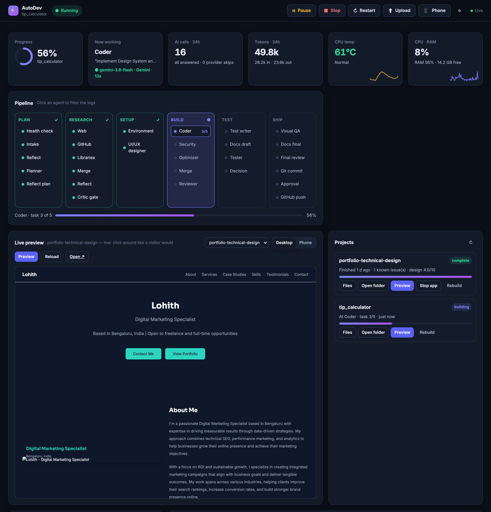
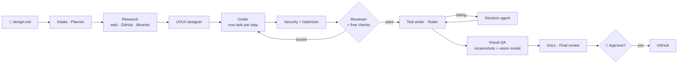

<div align="center">

# ⚡ AutoDev Agents

**Drop in a design doc. Get back a working, tested, reviewed project — built by 17 AI agents on free LLM tiers.**

   



</div>

You write what you want in a Markdown file. AutoDev plans it, researches it, designs the UI,
writes the code one task at a time, reviews it, tests it, screenshots it in a real browser,
fixes what looks wrong, writes the README — and then **asks you on your phone** before it
pushes anything to GitHub.

## Why it's different

- **$0 to run.** Every call goes to free tiers (Gemini, NVIDIA NIM, OpenRouter `:free` models)
  through one router that knows each provider's limits: it rests a model until its daily quota
  resets, backs off on rate limits, and falls through to the next model instead of failing.
- **Bugs caught without spending AI calls.** ruff, mypy, bandit, pip-audit and a headless-Chrome
  page check find certain bugs for free — JS errors, missing files, empty sections, white text on
  a white card in dark mode, a security header that blocks the page's own styles — and hand them
  to the coder as facts, not opinions.
- **Guards against the ways LLMs break code.** Free models "lazily" reply with
  `<!-- Sections omitted for brevity -->`, rewrite a page from a partial view, or "optimize" a file
  down to nothing. Every agent that writes whole files goes through the same check: a version
  that drops sections, functions or most of its lines is refused and redone as small edits.
- **Stop it any time.** Every step is checkpointed (LangGraph + SQLite). Close the laptop, lose
  power, hit Stop — it resumes exactly where it was.
- **Watch it from your phone.** Live dashboard: which agent *and which model* is working right
  now, every AI call and which provider limit was hit, and a clickable preview of the site being
  built. Over Tailscale, no port forwarding.
- **Nothing ships without you.** A finished project is committed locally and waits for
  **Approve** or **Reject**. Before any push a secret scan checks the files *and the whole git
  history* for API keys; repos are created private.

## How it works



## Quick start

One line, on macOS or Linux (Windows: inside WSL) — it downloads AutoDev, installs it, asks for a
free API key and opens the dashboard:

```bash
curl -fsSL https://raw.githubusercontent.com/karthikkushi/autodev-agents/main/install.sh | bash
```

Run the same line again any time to update and start it. Needs Python 3.10+ and git.

Then press **Upload** in the dashboard to add your design (a Markdown file describing what you
want — `design_inbox/tip_calculator.md` is a complete example) and press **Start**. Built
projects land in `~/autodev-agents/projects/<name>/`.

<details><summary>Manual install</summary>

```bash
git clone https://github.com/karthikkushi/autodev-agents.git
cd autodev-agents
python3 -m venv .venv && .venv/bin/pip install -r requirements.txt
cp .env.example .env      # add at least one free API key
.venv/bin/python main.py  # opens the dashboard at http://localhost:8081/ui
```
</details>

You need at least one free key (the installer asks for the Gemini one):

| Provider | Free key at | Env var |
|---|---|---|
| Google Gemini | aistudio.google.com | `GOOGLE_API_KEY` |
| NVIDIA NIM | build.nvidia.com | `NVIDIA_API_KEY` |
| OpenRouter | openrouter.ai | `OPENROUTER_API_KEY` (only `:free` models are used) |

`router/roles.py` sets which models each role tries, in order; `.env.example` lists more free
providers (Groq, Mistral, Cloudflare…) and their limits, ready to add there.

**Phone:** install Tailscale on the computer and the phone; the dashboard's 📱 Phone button shows
the address to open. **GitHub:** log in once with `gh auth login` — no token is stored in any file.

**Status:** an experiment that works end to end, developed on macOS. Free models vary a lot in
quality, so expect to Reject some builds — the dashboard makes that one tap, and Rebuild another.

## Routing

`router/roles.py` lists, per role (fast, reasoning, coding, review, vision),
the free models to try in order; `router/llm_router.py` calls them with
`litellm.completion` and moves on after **any** error. It also:

- rests a model after it fails, for as long as the provider says: until the
  daily reset when a daily quota is used up (Gemini's free tier resets at
  midnight Pacific), the provider's own retry delay when it gives one, else
  a backoff (rate limit 1 min doubling to 30 min, timeout 10 min, 404 / no
  access 1 hour). Rests are saved in `logs/provider_cooldowns.json`, so
  restarts, the server and the benchmark all respect them, and only one call
  at a time may test a model that has just come off a rest;
- keeps the full text of every provider error in `logs/provider_errors.jsonl`
  (API keys removed) and a one-line reason on the dashboard;
- enforces a hard 3-minute limit per call (a hung provider can't freeze a run);
- switches off built-in "thinking" on NVIDIA/OpenRouter reasoning models;
- leaves Gemini 3 models at their default temperature (Google advises
  against lowering it);
- saves any reply that hit its token limit to `logs/cut_off_replies/`;
- pauses before each call while you've pressed Pause or the internet is down.

`python3 -m pytest tests/ -q` checks the pipeline itself offline (reply
parsing, the decision loop's rules, visual QA rollback) — no model calls.

`python3 tools/benchmark_models.py` benchmarks the free models on your
account (a coding task scored by running pytest, plus a JSON task) — re-run it
before reordering `roles.py`; provider catalogs change and list models your
account can't call.

## How agents return code

Every agent that writes files returns plain file blocks, not JSON:

```
=== FILE: src/app.py ===
<file content, nothing escaped>
=== END FILE ===
```

Models write measurably worse code when it has to be escaped inside JSON, and
a reply cut off mid-JSON loses every file; with blocks, a cut-off reply still
yields every finished file (`tools/file_blocks.py`). Paths are checked
(`tools/file_ops.py`): no absolute paths, no `..`, no extension-less "files".

Replies that are JSON (plans, reviews, scores) all go through
`tools/llm_json.py`: fences stripped, a strict parse from each `{`/`[`, and
`json-repair` only as a last resort (with a warning — a repaired reply may
have been cut off).

## Free checks (no AI quota)

`tools/static_checks.py` runs open-source tools on the generated code; their
findings are certain, so they go to the coder as high-severity fixes:

| Tool | Runs in | Catches |
|---|---|---|
| ruff (E9, F63, F7, F82) | coder (every task), reviewer | syntax errors, undefined names |
| mypy (only import errors) | reviewer | imports that can't work, e.g. `from models import X` when X doesn't exist |
| web check | reviewer | stylesheets browsers can't read (raw `@tailwind`, Tailwind classes nothing defines), links to missing files, scripts no page loads |
| page check (headless Chrome) | reviewer, web projects | JavaScript errors, files that fail to load, sections that render empty, text you can't read (light and dark mode), headings no bigger than body text, a Content-Security-Policy blocking the page |
| bandit (MEDIUM+) | security | shell injection, unsafe deserialization, hard-coded secrets… |
| pip-audit | security | known-vulnerable packages in the project's `.venv` (needs internet) |

Results are written to `docs/05c_static_checks.md` in each project. A missing
tool or a timeout is skipped with a note, never an error.

## Shadow Auditor (optional)

`--auditor` starts a background thread that uses the same router ("fast"
role) to silently critique what the other agents produce, and pushes
findings to the phone/dashboard as notifications. It never blocks or
modifies the main pipeline — a failed audit call is just skipped.

## No CPU/RAM throttling

Every agent call is a network request to a cloud API, not local inference,
so there's nothing local to protect the machine from. `tools/safety.py`
still exposes `get_health()` for the dashboard's live CPU/RAM readout, but
nothing in the pipeline blocks on it.

## Coder ↔ reviewer escalation ladder

Replaces a flat retry cap. Tracked via `state["coder_round"]`
(`pipeline/state.py`, `MAX_REVIEW_ROUNDS = 20`):

- **Rounds 1-20** — reviewer finds high-severity issues → coder patches only
  the flagged file's broken lines (reads the current file, minimal-edit
  prompt — `agents/coder.py`'s `is_fix` branch), never a full rewrite →
  back to reviewer. Each round's report is saved to `state["review_history"]`.
  If three rounds in a row don't beat the fewest high-severity issues so far,
  that round's patch is the last one (more rounds would only re-argue the same points).
- **Decision** — after the last patch, reviewer is *not* called again.
  `coder.py` sets `phase="decision_escalation"`, and `route_after_coder`
  sends the pipeline straight to `decision`, which gets every review report
  and fixes the code directly (forced fix-only — it cannot backtrack to
  planner once `coder_round >= MAX_REVIEW_ROUNDS`).
- **Tester** — runs against decision's fix. If it fails, decision gets
  exactly one more fix attempt (`state["escalation_decision_count"]`).
- **Then** — the pipeline always proceeds to `doc_writer` / `final_review`
  regardless of outcome. Any remaining `state["errors"]` are copied into
  `state["known_issues"]` and printed in the final report's "Known Issues"
  section. The coder isn't called again after the last review round.

## Structure

```
router/       — per-role free model lists (roles.py) + fallback/cooldown/timeout router
auditor/      — Shadow Auditor (same router, "fast" role — no local model)
agents/       — 17 agents, each calling router.get_llm(role)
pipeline/     — LangGraph wiring (graph.py), state (state.py), pause/offline/checkpoints (control.py)
server/       — control server: dashboard, WebSocket, buttons, worker process, port 8081
tools/        — file blocks, file ops, per-project venvs, web-app runner + screenshots,
                memory (Gemini embeddings), safety allowlist, web search, model benchmark
dashboard/    — web UI, served at /ui (also installable on the phone's home screen)
design_inbox/ — drop or upload a design .md here (tip_calculator.md is an example)
projects/     — generated projects, each with its own .venv
logs/         — worker/server logs, checkpoints.sqlite, AI-call history, access code
Start AutoDev.command, start_autodev_api.sh — launchers
```

## Pipeline flow (17 agents)

```
intake → planner (+ reflect) → research: web / GitHub / libraries → merge → critic gate (↺ research, max 2)
  → environment (project .venv, installs, config) → UI/UX designer (web projects: design system)
  → coder, one task per step (syntax-checked; checkpoint after every task)
  → security + optimizer → merge → reviewer (↺ coder patch rounds, up to 20, then decision)
  → test writer + README draft → tester (pytest in the project venv, debugger fixes)
      failing → decision (fix / re-plan; capped: 3 calls, 3 backtracks) → tester …
  → visual QA (web projects: desktop + real phone-size screenshots via Chrome
    DevTools emulation, vision review, up to 2 fix rounds; a fix that scores
    lower or breaks the tests is undone)
  → README final + final review → git commit → approval from phone/dashboard → GitHub push
```

## License

Apache License 2.0 — see [LICENSE](LICENSE).
